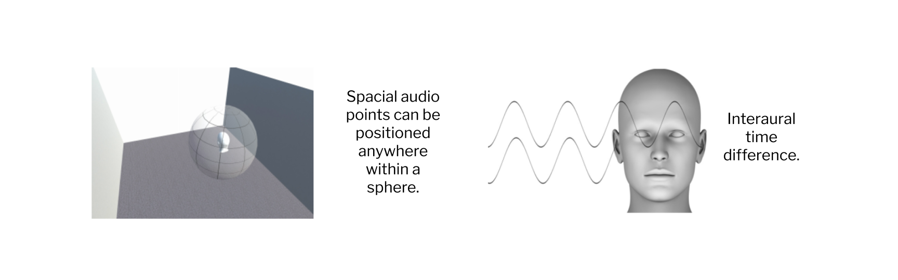
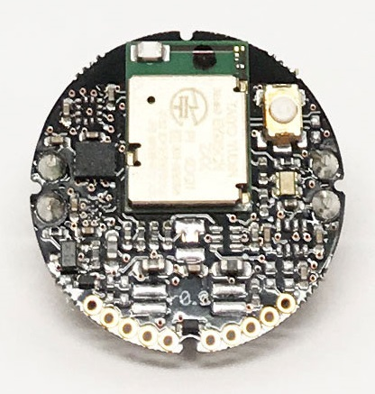
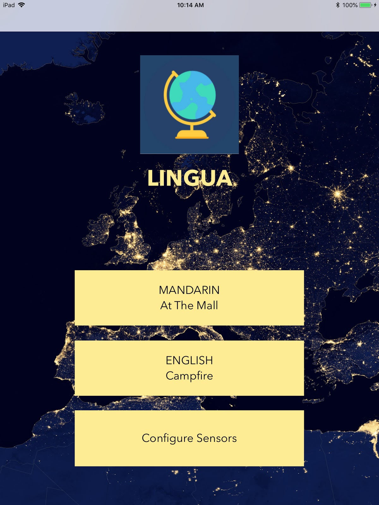
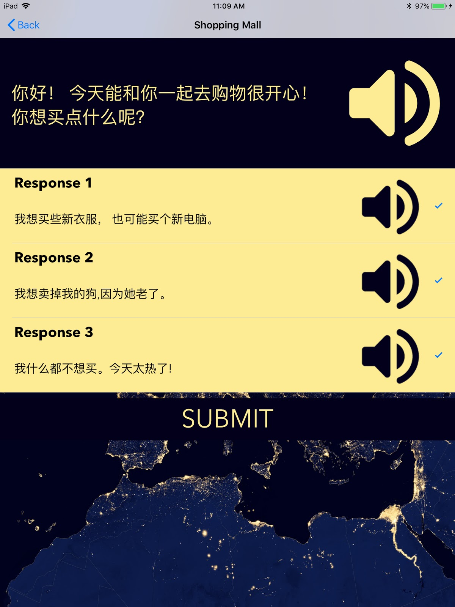

# Lingua

<div align="center">
    
</div>

Lingua is an iOS app that creates an immersive 3D language learning experience through sound spatialization.\
This application is created in the UC Irvine COSMOS program of summer 2018 (Cluster 5: Sound for Virtual Reality).

# Overview

Bilingualism has become a crucial skill for both economic and cultural interaction. Many language learners seek culturally immersive experiences to improve their fluency in a second language. However, this experience can be costly and inconvement. Lingua address this issue in language learning by utilizing sound spatialization to create an immersive language learning environment.

# Introduction to Sound Spatialization



This application creates an immersive setting through spherical sound spatialization through headphones. It processes sound to give the user an illusion of being in a realistic 3D environment.

Sound spatialization makes use of Interaural Time Difference (ITD) which is the delay in time that a sound takes to reach both ears. A centered sound will reach both ears at the same time where a sound that is positioned to our left side will reach the left ear sooner than it reaches the right ear. This delay is part of the information the brain uses to tell us that the sound is positioned to our left.

# Usage

## Required Equipment
* Device running iOS 10.0 or later with Bluetooth 4.0
* [MetaWearC Board](https://mbientlab.com/store/metawearc/)

<div align="center">
    
</div>

## Installation

Clone the source:
```sh
git clone https://github.com/kyroschow/Lingua.git
```

Install pods (requires CocoaPods)
```sh
cd MetaWear
pod install
```
```sh
cd StarterProject
pod install
```
Open the project with XCode, and deploy it to your device.\
Open the app, go to "Configure Sensors", and connect to your MetaWear sensor. Now you can explore different features of the app.

# Built with

* XCode
* Swift 5.0
* [MetaWear SDK](https://github.com/mbientlab/MetaWear-SDK-iOS-macOS-tvOS)

# Features

<div align="center">
       
</div>

* __Interactive mode:__ Enables the user to choose responses to questions asked as a storyline progresses.\
  It allows users to pick from three possible answer choices, and includes English translations for beginners to understand.
* __Campfire story:__ Immerses the listener into a camping environment where a person tells a scary story. The listener will be able to hear voices, environmental sounds, and footsteps.
